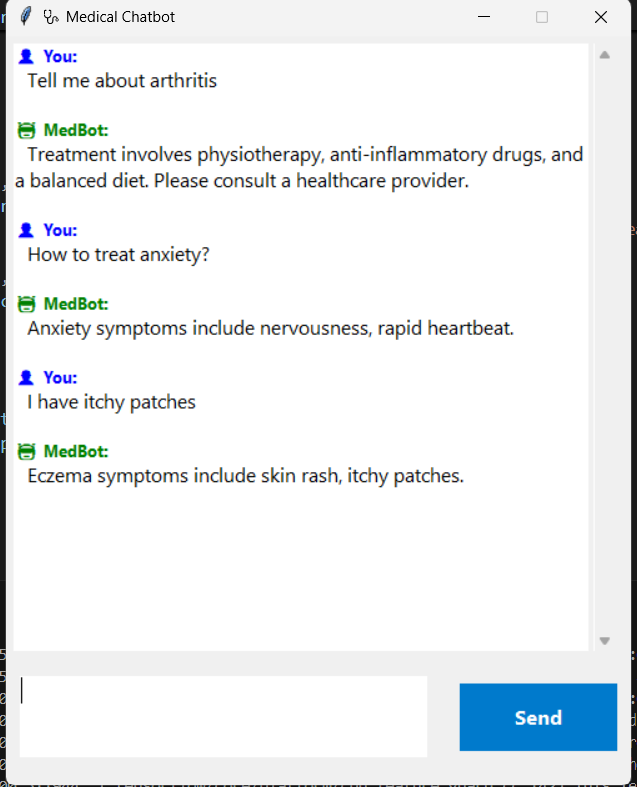
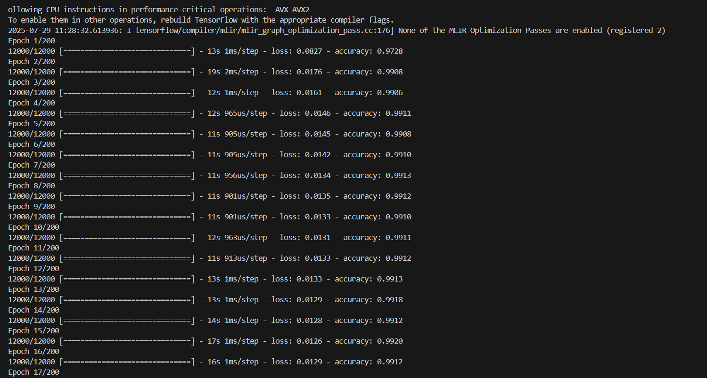

# 🤖 Medical Chatbot using NLP and TensorFlow

A simple AI-powered chatbot built with Natural Language Processing (NLP), Machine Learning (TensorFlow/Keras), and a user-friendly GUI (Tkinter). This bot understands basic medical-related conversations and responds based on trained intents.

---

## 🧠 Features

- Intent classification using a neural network
- Predefined responses for each intent
- Interactive GUI built with Tkinter
- Easy customization with `intents.json`
- Supports training with new data

---
## 📸 Preview

### GUI Chatbot Interface  


### Training Output Preview  


---

## 📂 Project Structure

| File / Folder       | Description                                                                 |
|---------------------|-----------------------------------------------------------------------------|
| `intents.json`       | List of user patterns, intents, and responses                               |
| `train_chatbot.py`   | Preprocessing and training script for the chatbot                           |
| `chatgui.py`         | GUI interface to chat with the bot                                          |
| `requirements.txt`   | Required Python libraries                                                    |
| `chatbot_model.h5`   | Trained model file (generated after training)                               |
| `words.pkl`          | Pickled vocabulary list (generated after training)                          |
| `classes.pkl`        | Pickled list of intent classes (generated after training)                   |

---

## ⚙️ Setup Instructions

### 1️⃣ Clone the Repository

```bash
# Clone the repo
git clone https://github.com/your-username/medical-chatbot.git
cd medical-chatbot

# Optional: Create virtual environment
py -3.8 -m venv tf-env
Set-ExecutionPolicy RemoteSigned -Scope CurrentUser
.\tf-env\Scripts\activate  # Windows

# Install required packages
pip install -r requirements.txt

# Train the chatbot
python train_chatbot.py

# Run the GUI chatbot
python chatgui.py


